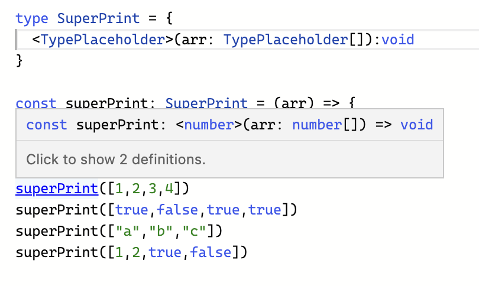
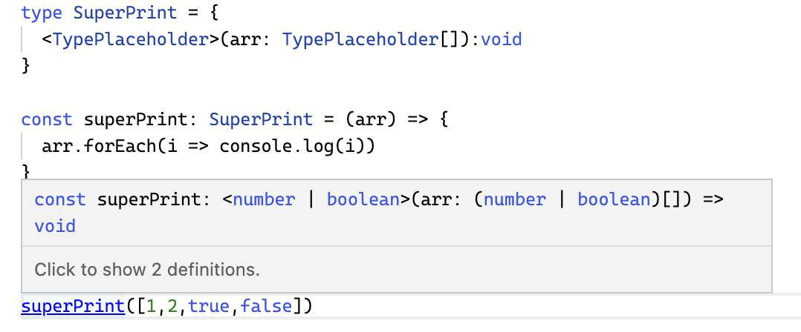
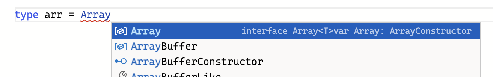

# 🚀 TypeScript 처음 시작하기

타입스크립트에 첫 입문하면서 노마드코더님의 강의 [Typescript로 블록체인 만들기](https://nomadcoders.co/typescript-for-beginners/lobby)를 들으며 실습하고 정리한 기록입니다.

</br></br>

## 💙 typeScript ➕ VScode

타입스크립트와 vs코드가 같은 마이크로 소프트에서 만들었기 때문에 호환이 아주잘되어서 개발자 경험이 좋다.

</br></br>

## ⚠️ Why not JavaScript

- 타입스크립트는 자바스크립트에 비해 **타입 안전성**이 좋다. => 개발자 경험이 좋다. 버그를 줄일 수 있다. 런타임 에러 줄인다. 생산성 증대시킨다.
- 자바스크립트는 타입 안전성이 없다.
- 자바스크립트는 되도록 에러를 보여주지 않으려 알아서 처리하는 일이 많다. 이게 개발자에게 별로 도움이 안된다.

```js
/*
😳 자바스크립트는 이렇게 이상한 코드도 실행시켜준다.
다른 언어에선 꿈도 못 꿀 일
*/

[1, 2, 3, 4] + false; //'1,2,3,4false'
//배열 + 불리언 = 스트링(불리언도 스트링으로 합쳐짐)

function divide(a, b) {
  return a / b;
}
divide(2, 3); //0.6666666666666666
divide('xxxxxxxx'); //NaN (코드 실행을 막아주고 있지 않다. 이게 실행되면 안되는 거지😫!!)

//인자로 숫자를 전달해야 하는지 문자를 전달해야하는지, 몇개의 인자를 전달해야하는지 이런것들을 정해서 잘못보냈으면 체크해야 한다!!
```

- 런타임 에러는 콘솔 안에서 일어나는 에러이다. (이런 에러는 유저의 컴퓨터에서 코드가 실행될 때만 일어나는 에러일 수도 있다.)
- 자바스크립트 런타임 오류는 유저나 매니저나 동료 개발자들이 알아차리고 알려주는 경우가 많다!

```js
const nico = { name: 'nico' };
nico.hello(); //Uncaught TypeError: nico.hello is not a function

/*지금처럼 ⚠️컴퓨터가 실행시키고 나서 에러를 출력하는 것이 아니라⚠️
실행시키기 전에 hello()라는 함수가 없다는 걸 알려주고 ✨"고치면 실행시켜줄게!"✨가 가장 좋다.*/
```

- **말도안되는 코드**를 **실행이아니라 작성 단계부터** 바로잡는 것! 그게 바로 타입스크립트가 자바스크립트보다 진화된 면이라고 볼 수 있다.

</br></br>

## 🤔 How TypeScript Works

- 타입스크립트는 strongly typed programmin language 강력한 타입을 가진 프로그래밍 언어이다.
- 타입스크립트로 작성한 코드는 자바스크립트로 변환된다.[타입스크립트 플레이그라운드](https://www.typescriptlang.org/play?#code/PTAEHUFMBsGMHsC2lQBd5oBYoCoE8AHSAZVgCcBLA1UABWgEM8BzM+AVwDsATAGiwoBnUENANQAd0gAjQRVSQAUCEmYKsTKGYUAbpGF4OY0BoadYKdJMoL+gzAzIoz3UNEiPOofEVKVqAHSKymAAmkYI7NCuqGqcANag8ABmIjQUXrFOKBJMggBcISGgoAC0oACCbvCwDKgU8JkY7p7ehCTkVDQS2E6gnPCxGcwmZqDSTgzxxWWVoASMFmgYkAAeRJTInN3ymj4d-jSCeNsMq-wuoPaOltigAKoASgAywhK7SbGQZIIz5VWCFzSeCrZagNYbChbHaxUDcCjJZLfSDbExIAgUdxkUBIursJzCFJtXydajBBCcQQ0MwAUVWDEQC0gADVHBQGNJ3KAALygABEAAkYNAMOB4GRonzFBTBPB3AERcwABS0+mM9ysygc9wASmCKhwzQ8ZC8iHFzmB7BoXzcZmY7AYzEg-Fg0HUiQ58D0Ii8fLpDKZgj5SWxfPADlQAHJhAA5SASPlBFQAeS+ZHegmdWkgR1QjgUrmkeFATjNOmGWH0KAQiGhwkuNok4uiIgMHGxCyYrA4PCCJSAA)로 실험해 볼 수 있다.
- 타스 ➡️ 자스로 변환하는 이유는 브라우저와 Node.js가 타스가 아니라 자스를 이해하기 때문이다.
- 타입스크립트가 그저 자바스크립트를 변환해 줄 뿐이라면 어떻게 우리를 보호해 주는 걸까?? ➡️ 타입스크립트 코드가 자바스크립트로 변환되기 **전**에 타스가 먼저 우리의 코드를 확인한 다음에 자스에서 바보같은 실수가 일어나지 않게 보호장치를 발동시킨다! **타입스크립트 코드에 에러가 있으면 자스로 아예 컴파일이 되지 않는다.** 이런 보호장치가 유저가 코드를 실행하는 런타임에 발생하는 게 아니다.

</br></br>

## 🥊 Implicit Types vs Explicit Types

- 어떤 언어에선 변수를 설정한다면 그 변수의 타입이 뭔지 정해줘야한다.(이 변수는 항상 숫자여야해, 문장이어야해 등) 타스는 이런 접근법에 + a를 추가한다.
- 타입스크립트는 **데이터와 변수의 타입을 명시적으로 정의하는 방법**을 써도, 아니면 **그냥 JavaScript처럼 변수만 생성하고 넘어가도** 된다. 이때는 타스가 타입을 추론해 준다!!😇

```js
//📌 타스의 자동 타입 추론 기능 활용하기 (Implicit)

let a = 'hello'; //이렇게 적어줘도 타스가 알아서 "아! a는 string 타입이구나!!"함
a = 'bye'; //같은 string 타입으로 바꾸기 때문에 타스가 불평 안함
a = 1; //string에서 number타입으로 바꾸려니까 타스가 불평함😡

//📌 타스에게 친절하게 타입 알려주기 (Explicit)

let b: boolean = 'x'; // b는 boolean타입이어야 한다고 알려줬는데 string 넣으니까 타스가 불평한다.😡

//하지만 결국 아래의 두 코드는 같으므로, 되도록 짧은 쪽을 선택하는 것을 추천한다.
let c = false; //👑 추천 (Implicit)
let c: boolean = false;
```

- 하지만 명시적(explicit) 타입도 유용하게 쓰인다. (예를 들어 먼저 값을 할당하지 않을 경우엔 타입을 명시해줘야 한다.)

```js
//before💩
let a = [];
a.push('1');
a.push(2); //타스의 보호를 못받음 ➡️ 에러가 나지 않는다.😈

//after✨
let b: number[] = []; //number arr라고 미리 선언한다.
b.push('1'); //타스의 보호를 받음 ➡️ 에러가 난다.😇
b.push(2);
```

</br></br>

## 🍱 Types of TS

### 🍣 basic 타입

- 지금까지 등장한 기본적인 타입들의 사용법은 아래와 같다.

```js
//Implicit Types 👑
let a = 1;
let b = 'i1';
let c = true;
let d = [1, 2];
let e = ['i1', '2'];
let f = [true, false];

//Explicit Types (필요한 경우가 아니라면 Implicit Types 추천)
let a: number = 1;
let b: string = 'i1';
let c: boolean = true;
let d: number[] = [1, 2];
let e: string[] = ['i1', '2'];
let f: boolean[] = [true, false];
```

</br>

### 🍣 객체의 타입

- 객체의 타입은 기본적으로 `let name: {key: type;} = {key: value;}`식으로 적을 수 있다.
- 객체 내부에 키가 있을 수도 없을 수도, 있다면 어떤 타입으로 존재할 건지 정하려면 `key?: type`를 적으면 된다.

```js
let player: {
  name: string,
  age?: number, //❓ = player은 age를 가질 수도, 아닐 수도 있다.
} = {
  name: 'nico', //❓를 써줘서 age를 지정하지 않아도 에러가 나지 않는다.
};

// ⛔️ if(player.age < 10){ //❓를 써줬기 때문에, undefined가 나오면 제대로 비교를 할 수 없다. ➡️ 에러가 난다.😇
if (player.age && player.age < 10) {
  // 먼저 체크부터 해준다는 조건을 넣으면 통과 so sweet...🍬 다정해..
}

player.age = 3;
player.age = '3'; //타스의 보호를 받음 ➡️ 에러가 난다.😇
```

</br>

### 🍣 Alias 타입

- 같은 모양과 타입의 객체를 여러개 만들때, 위와 같은 방식은 코드 중복이 많이 일어난다. 이때는 따로 객체 전체를 타입으로 지정하여 쓰는 방법도 있다.
- 이런 방법이 바로 **Alias 타입**이라고 한다.

```js
// 🧹 Alias 타입으로 객체 형태 자체를 타입으로 지정하기
type Age = number;
type Name = string;
type Player = {
  //uppercase 로 type을 지정하는게 관례
  name: string, //1️⃣name: Name 가능
  age?: number, //2️⃣age?: Age 가능
  /*
  위에서 Age와 Namge의 타입을 따로 Alias 타입으로 정해줬기 때문에
  1️⃣이나2️⃣와 같은 표현도 가능하다.
  */
};

let nico: Player = {
  name: 'nico',
};
let lynn: Player = {
  name: 'lynn',
  age: 3,
};
```

</br>

### 🍣 함수 타입

- 함수가 리턴하는 값의 타입을 정해줘서 안정적인 함수를 만들 수도 있다.
- 물론 함수의 인자가 받을 타입도 지정할 수 있다.

```js
//💩 before
function playerMaker(name: string) {
  return {
    name,
  };
}

const nico = playerMaker('nico');
nico.age = 12; //age라는 프로퍼티를 return 값에 정의해 놓지 않아서 오류남

//✨ after
type Player = {
  name: string,
  age?: number,
};
function playerMaker(name: string): Player {
  //🔥return 할 객체가 Player 타입을 갖게 될 것이라고 알려주기
  return {
    name,
  };
}

const nico = playerMaker('nico');
nico.age = 12; //age라는 프로퍼티를 return 값에 정의해 놓지 않아서 오류남

//📌 arrow function ver.
type Player = {
  name: string,
  age?: number,
};
const playerMaker = (name: string): Player => ({ name });
const nico = playerMaker('nico');
nico.age = 12;
```

</br>

### 🍣 readonly 속성이 포함된 타입

- `readonly`속성을 줘서 요소들을 **읽기 전용**으로 만들 수 있다.

```js
type Player = {
  readonly name: string; //📙 읽기 전용 옵션 추가
  age?: number;
};
const playerMaker = (name:string) : Player => ({name})
const nico = playerMaker("nico")
nico.age = 12
nico.name = "las" //readonly인데 name을 바꾸려니까 ➡️ 에러내서 알려줌😇
```

- 이 readonly 가능은 배열이나 string에서도 아주 유용하다.

```js
const numbers: readonly number[] = [1,2,3,4]
numbers.push(1) //readonly인데 추가하려하니까 ➡️ 에러내서 알려줌😇

const names : readonly string[] = ["nico","lynn"]
names.push('las') //readonly인데 추가하려하니까 ➡️ 에러내서 알려줌😇
names.filter(name => name === "nico" ? true : false) //📌filter나 map 등 은 immutable이므로 readonly에 위배되지 않아서 오류를 내지 않는다.
```

</br>

### 🍣 Tuple

- tuple은 최소 length가 몇이고, 특정 위치에 특정 타입이 있어야 하는 배열 조건을 걸 수 있다.

```js
const player: [string, number, boolean] = ['nico', 12, false];
//최소 3개의 요소를 가져야한다.
//요소의 순서는 차례대로 string,number,boolean이어야 한다.
player[0] = 1; //string자리에 number추가 ➡️ 에러내서 알려줌😇
```

- tuple에서도 `readonly`옵션을 결합할 수 있다.

```js
const player: readonly [string, number, boolean] = ['nico', 12, false]
player[0] = 'hi'
```

</br>

### 🍣 undefined, null 그리고 any 타입

```js
let a: undefined = undefined; //undefined의 타입은 undefined이다.
let b: null = null; //null의 타입은 null이다.
```

- any 타입은 TypeScript로 부터 탈출하는 탈출구이다.
- 가끔씩은 any를 써야할 때도 있다 but!! any를 쓸거면 뭐하러 타스를 쓰냐 싶어 권장하지 않는다.👎🏻

```js
let c: any; //할당되지 않은 변수는 any라는 타입이 된다. === let c
let d = []; //아무 타입도 정하지 않은 배열은 any[] 타입이된다.

const e: any[] = [1, 2, 3, 4];
const f: any = true;
e + f; //이게 가능해진다. 그냥 js처럼
```

</br>

### 🍣 unknown 타입

- 만약 api로 부터 응답을 받는데 그 형식이 뭔지 모른다면 `unknown`타입을 쓸 수 있다.
- any타입과 비슷하지만 any보다 unknown이 더 안전하다. 이유는 unknown값으로 작업을 수행하는 것은 합법적이지 않기 때문

```js
//💩 before
let a: unknown;
let b = a + 1; //뭐가 들어올지 모르는데 더한다고? ➡️ 응 타스는 반대야😇

//✨ after
let a: unknown;
if (typeof a === 'number') {
  let b = a + 1;
}
if (typeof a === 'string') {
  let b = a.toUpperCase();
}
```

</br>

### 🍣 void 타입

- void > unknown > never 순으로 자주 쓰임.
- void는 아무것도 return 하지 않는 함수에 해당하는 타입이다.
- 함수에 return 문이 없거나 해당 return 문에서 명시적 값을 반환하지 않을 때 항상 유추되는 타입이다.

```js
function hello() {
  console.log('this function is void type!');
}
hello().toUpperCase(); //아무것도 리턴안하는데 대문자로 바꾼다고? ➡️ 응 타스는 반대야😇

//참고로 아래와 같으므로 굳이 아래처럼 명시할 필요가 없다.
function hello(): void {
  console.log('this function is void type!');
}
```

</br>

### 🍣 never 타입

- 거의 쓸일 없으나 알아두기
- never는 함수가 절대 return하지 않을 때 발생한다.
- 함수가 예외를 throw하거나 프로그램 실행을 종료함을 의미한다.

```js
//💩 before
function hello(): never {
  return 'X'; //절대로 return 하면 안되는데 왜 리턴해? ➡️ 응 타스는 반대야😇
}

//✨ after
function hello(): never {
  throw new Error('X'); //return 하지 않고 오류를 발생시키는 함수니까 okay
}
```

- 또는 `never`은 타입이 두가지 일 수도 있는 상황에 발생할 수 있다.

```js
function hello(name: string | number) {
  //hello라는 함수가 인자로 string 혹은 number인 name을 인자로 받음
  if (typeof name === 'string') {
    name; //📌이 name의 타입은 'string'이다.
  } else if (typeof name === 'number') {
    name; //📌이 name의 타입은 'number'이다.
  } else {
    //인자가 맞게 들어오면 이 코드는 절대 실행되지 않아야 한다.
    name; //📌이 name의 타입은 ✨'never'✨이다.
  }
}
```

</br></br>

## 🚘 functions

### 🛞 Call Signature

- call signatrue란 기본적으로 마우스를 올렸을 때 보게되는 조건들을 말한다.어떻게 함수를 호출해야하는지 알려준다.인자의 타입과 반환 타입을 알려준다.
  
- call signature를 먼저 선언한다 = 타입을 먼저 선언한다.
- 함수를 구현하기 전에 인자와 리턴의 타입부터 정하는 방법은 깔끔하다. 첫번째로 타입을 생각하도록 해주고, 그 다음 구체적으로 코드를 적으면, 타입이 실제 코드랑 분리되서 가독성도 좋다.

```js
type Add = (a: number, b: number) => number; //📌call signatures
// type Add = {
//     (a:number,b:number) : number;
// } //이렇게 정의할 수도 있음.
const add: Add = (a, b) => a + b;
//더이상 인자와 return 값의 타입을 적어주지 않아도 된다.
```

</br>

### 🛞 Overloading

- 외부 패키지나 라이브러리를 사용할 때, 그 친구들이 오버로딩을 엄청 많이 씀. 때문에 우리가 오버로딩을 직접 작성하지 않아도 알아두는 것이 중요하다.
- 오버로딩은 **함수가 서로다른 여러개의 call signatures를 가지고 있을 때** 발생된다.
- 다시말해 오버로딩은 **여러개의 call signatures를 갖고있는 함수**이다.

```js
type Add = {
    //Add라는 타입은 1️⃣로도, 2️⃣로도 구현될 수 있다.
    (a:number,b:number) : number //1️⃣
    (a:number,b:string) : number //2️⃣
}
const add: Add = (a,b) => { //a는 number타입, b는 number나 string타입이다.
    //그냥 a+b를 리턴하게 작성하면 b가 string일 경우 num + string에의한 타입스트립트 오류가 발생한다.
    if(typeof b === "string") return a //string일땐 따로 처리해준다.
    else return a+b
}
```

- 위는 실재로 별로 작성할 일 없는 코드고, 아래에서 우리가 패키지나 라이브러리를 쓸 때 마주칠 수 있는 overload의 예시를 볼 수 있다.

```js
//Next.js의 코드 예시
//객체로도, string으로도 인자를 넘겨줄 수 있다.
Router.push({
  path: "/home",
  state: 1
})

Router.push("/home")

//위가 가능한건 아래와 같이 오버로드로 정의했기 때문이다.

type Config = {
  path: string,
  state: object
}

type Push = {
  (path:string) : void //아무것도 리턴하지 않으므로 void
  (config: Config) : void
}

const push : Push = (config) => {
  if(typeof config === "string") console.log(config)
  else {
      console.log(config.path, config.state)
    }
}
```

- signature도 다르고, arguments의 number도 다른 경우가 있을 수 있다.

```js
//💩before
type Add = {
  (a:number, b:number) : number
  (a:number, b:number, c:number) : number
}

const add:Add = (a, b, c) => { //c인자는 optional한데 그냥 넣어주고 있어서 불평한다.
  return a + b
}

//✨after
type Add = {
  (a:number, b:number) : number
  (a:number, b:number, c:number) : number
}

const add:Add = (a, b, c?:number) => { //optional한 것에 맞게 넣어준다. optional하고 들어갈거면 number일거야!!
  if(c) return a + b + c
  return a + b
}

add(1,2)
add(1,2,3)
```

</br>

### 🛞 Polymorphism

- Polymorphism은 '다형성'(many diffrent structures)을 뜻한다. (poly = many,several,much, morphos = form,structure)
- overloading파트를 통해 2-3개의 parameter를 가질 수 있음을 확인했다.
- 이런식으로 call signature에 추가할 타입들이 길어질 때, 더 나은 방식이 Polymorphism이다.(물론 call signature을 활용하는 방법도 작동은 하지만, Polymorphism이 더 깔끔)
- 함수를 사용할 떄는 concrete type의 값을 넣어주겠지만, 함수의 call signature를 작성할 때 concrete type을 알 수 없을 때도 있다. 이때 Polymorphism을 사용한다고 봐도 된다.
- **concrete type** 이란 number, boolean, string, void, unknown 등 위에서 이제 까지 나온 타입을 말한다.
- **generic type**의 generic은 placeholder를 의미한다.concrete type을 사용하는 대신에 쓸 수 있다. placeholder를 작성하고, 그게 뭔지 추론해서 함수를 사용한다.
- **제네릭은 선언 시점이 아니라 생성 시점에 타입을 명시하여 하나의 타입만이 아닌 다양한 타입을 사용할 수 있도록 하는 기법이다.**

```js
//💩before
type SuperPrint = { //Call Signature작성
  (arr: number[]):void
  (arr: boolean[]):void
  (arr: string[]):void
  // (arr: (number|boolean)[]): void
}

const superPrint: SuperPrint = (arr) => {
  arr.forEach(i => console.log(i))
}

superPrint([1,2,3,4])
superPrint([true,false,true,true])
superPrint(["a","b","c"])
superPrint([1,2,true,false]) //⛔️이부분에서 오류 발생!(call signature 작성되어 있지 않다. 🤦맨날 이렇게 추가해주면 아주 피곤하다.)

//✨after
type SuperPrint = {
  <TypePlaceholder>(arr: TypePlaceholder[]):void
  /*
  이 Call Sginature가 generic type을 받는 다는 것을 알려준다.
  이때 TypePlaceholder는 generic type의 이름으로,
  어떤 것이든 무관하나,⭐️<T>나 <V>를 많이 쓴다.⭐️

  많은 call signature type정의들이
  generic type사용으로 한방에 정리되었다!!🧹
  */
}

const superPrint: SuperPrint = (arr) => {
  arr.forEach(i => console.log(i))
}

superPrint([1,2,3,4])
superPrint([true,false,true,true])
superPrint(["a","b","c"])
superPrint([1,2,true,false])

//🚀feature upgrade
type SuperPrint = {
  <T>(arr: T[]): T
  //이번엔 T(generic)배열을 받아서 그중 하나를 리턴한다고 알려주기
}

const superPrint: SuperPrint = (arr) => arr[0]

const a = superPrint([1,2,3,4]) //number
const b = superPrint([true,false,true,true]) //boolean
const c = superPrint(["a","b","c"]) //string
const d = superPrint([1,2,true,false,"hello"]) //string|number|boolean
```

- `any[]`를 사용하는것과 뭐가다르냐 싶을 수도 있지만, `any[]`를 사용하면 더이상 타입이 지켜주지 않는다. 예를 들어 바로 위 코드에서 a,b,c,d의 타입이 모두 `any`가 된다. 그럼 실질적으로 그 변수들을 활용해서 `d.toUpperCase()`등의 오류를 뿌려줘야 할 때에도 오류를 내지 않는다. d는`number`인데!
- generic type으로 call signature를 작성하면, 함수를 사용할때 그 사용에 일치하는 타입으로 call signature를 추론해 대체해서 보여준다.
  
  
- 이 방식말고도 다른 방식으로 generic을 사용하는 방식이 존재하고, 실재로 react에선 그걸 더 많이 쓴다.
- generci type도 여러개의 call signature를 사용할 수 있다.

```js
type SuperPrint = { <T, M>(arr: T[], b: M): T };
const superPrint: SuperPrint = (arr) => arr[0];
const a = superPrint([1, 2, 3, 4], '');
```

- generic type을 실제로 어떻게 사용할까? 사실 generic type을 활용해사 call signature을 작성할 일은 거의 없을 것이다. **라이브러리를 만들거나, 다른 개발자가 사용할 기능을 개발하는 경우**에 제네릭이 유용하다.
- generic type을 사용하는 또다른 예시는 아래를 참고한다.

```js
/*
😩 before
generic type을 먼저 선언하고 함수를 만들어서 그 타입을 씌우는데
조금 어려워보여서 겁이 나게 생김
*/
type SuperPrint = <T>(a: T[]) => T;

const superPrint: SuperPrint = (a) => a[0];

const a = superPrint([1, 2, 3, 4]);
const b = superPrint([true, false, true]);
const c = superPrint(['a', 'b', 'c']);
const d = superPrint([1, 2, true, false, 'hello']);

/*
🤗 after
generic type을 작성하는 부분과 그 타입을 이용한 함수를 만드는 과정을
하나로 합쳐서 작성한 버전! 조금 덜 복잡하게 생긴거 같기도 하다.
*/
function superPrint<V>(a: V[]) {
  return a[0];
}

const a = superPrint([1, 2, 3, 4]);
const b = superPrint([true, false, true]);
const c = superPrint(['a', 'b', 'c']);
const d = superPrint([1, 2, true, false, 'hello']);

/*
🫠 if
아래와 같이 작성할 시에 오류가 난다.
타입스크립트가 generic type으로 유추해 만들어놓은 
number를 리턴하는 call signature에 
직접 boolean이라고 타입을 overwrite(덮어쓰기)를 하려했기 때문!
🛑 항상 타입스크립트가 타입을 유추하도록 하는 것이 좋다.
*/
const a = superPrint < boolean > [1, 2, 3, 4]; //⛔️
```

- 이밖에도 generic type에 다른 타입을 넣어서 확장해 사용할 수도 있다. type끼리 재사용이 가능하다.
- ✨**만약 많은 것들이 있는 큰 타입 하나를 가지고 있는데, 그 중 하나가 달라질 수 있는 타입**이라면, 거기에 generic을 넣으면 된다.그럼 그 타입을 많이 재사용할 수 있게된다.

```js
/*
아래의 1️⃣,2️⃣,3️⃣ 은 모두 generic type 을 생성하고 그 타입을 또 다른 타입에 넣어서 사용함으로써 확장해서 사용하는 모습을 보여준다.
1️⃣,2️⃣,3️⃣는 모두 같은 기능을 하는 코드이다.
*/

//1️⃣
type Player<E> = {
  //⬆️Player라는 타입은 gerneric type을 받는다고 알려주고
  name: string,
  extraInfo: E, //⬅️여기에 generic type이 쓰일거라고 알려준다.
};

const sooryeon: Player<{ favFood: string }> = {
  /*⬆️Player라는 타입이 generic 타입을 선언했는데
  그 타입을 갖는 sooryeon이란 변수에는
  generic type 자리에 { favFood: string }의 객체를 넣어서 사용할 것이다.*/
  name: 'sooryeon',
  extraInfo: {
    favFood: 'wine', //⬅️원래 E generic 타입이 있던 자리에 객체 들어감
  },
};

//2️⃣
type Player<E> = {
  name: string,
  extraInfo: E,
};

type SooryeonPlayer = Player<{ favFood: string }>;

const sooryeon: SooryeonPlayer = {
  name: 'sooryeon',
  extraInfo: {
    favFood: 'wine',
  },
};

//3️⃣
type Player<E> = {
  name: string,
  extraInfo: E,
};

type SooryeonExtra = {
  //이번엔 SooryeonExtra라는 type을 만들고 Player타입의 제네릭 안에 넣어준다.
  favFood: string,
};
type SooryeonPlayer = Player<SooryeonExtra>;

const sooryeon: SooryeonPlayer = {
  name: 'sooryeon',
  extraInfo: {
    favFood: 'wine',
  },
};

const lynn: Player<null> = {
  name: 'lynn',
  extraInfo: null,
};
```

- 자동완성 기능을 통해 확인해보면 배열을 만드는 Array역시 generic type을 통해 만들어진다는 것을 알 수 있다.
  
- 위와 같이 작성되어 있기 때문에 우리는 아래와 같은 코드로 배열을 만들 수 있다.

```js
type numberArr = Array<number>;
let a: numberArr = [1, 2, 3, 4];
```

- 따라서 아래의 두 함수는 모두 같다.

```js
function printAllNumbers(arr: number[]) {}
function printAllNumbers(arr: Array<number>) {}
```

- 이미 많은 라이브러리에서 ts의 gerneric type을 활용한다. 예를 들어 react에서 useState를 사용할 때에도 gerneric type을 활용하기 떄문에 아래와 같이 ts로 활용하는 사례가 매우 많다.

```js
useState<number>()
```

</br>

### 🥐 Classes

- TS는 객체 지향 프로그래밍을 하기에 아주 좋다.
- TS로 class 를 만드는 방법을 살펴본다.
- 기본적으로 js의 class에는 prviate이나 public의 개념이 없지만, java등에는 있다. ts는 안전성을 위해서 private과 public을 사용할 수 있게 해주지만, 당연히 컴파일링 된 js 파일에는 해당 부분은 존재하지 않게 된다.

```js
//✨TS version
class Player {
    constructor(
        private firstName: string,
        private lastName: string,
        public nickname:string
    ){}
    //js에서 constructor 함수안에 선언되야 하는 this.변수 = 변수 작업이 간단해진다.
}
const nico = new Player("nico","las","니꼬")
nico.firstName //⛔️컴플레인: private이기 떄문에 불평, 보호받을 수 있다.
nico.nickname //✅통과: public이기 때문에 접근 가능

//✨ JS version
"use strict";
class Player {
    constructor(firstName, lastName, nickname) {
        this.firstName = firstName;
        this.lastName = lastName;
        this.nickname = nickname;
    }
}
const nico = new Player("nico", "las", "니꼬");
nico.firstName; //js version에는 어떤 불평도 뜨지 않기 때문에 보호받지 못한다.
nico.nickname;
```

- **추상 클래스(abstract class)** 는 다른 클래스가 상속받을 수 있는 클래스이다. 하지만 이 클래스는 직접 새로운 인스턴스를 만들 수는 없다.

```js
abstract class User{
  constructor(
        private firstName: string,
        private lastName: string,
        public nickname:string
    ){}
}

const testUser  = new User("nico", "las", "니꼬");//⛔️컴플레인: abstract class 에서는 새로운 instance를 곧장 만들 수 없다.

class Player extends User{}
const nico = new Player("nico", "las", "니꼬");//✅통과: abstract class에서 바로 새로운 instance를 만든 것이 아니므로 ok

nico.nickname //조회가능
```

- **추상클래스의 메소드** 는 말그대로 추상 클래스 안에 선언되어 있는 일반적인 메소드를 말한다.
- **추상 메소드** 는 추상 클래스 내부의 보통 메소드와 다르다. **메소드를 클래스 안에서 구현하지 않으며 call siganature만!! 작성한다.**
- 추상 메소드는 추상 클래스를 상속받는 모든 것들이 구현을 해야하는 메소드를 의미한다.구현은 어떻게 하든 상관없지만 꼭 하긴 해야한다.

```js
//🤍🤍🤍abstract class 내부의 메소드 사용해보기
abstract class User{
  constructor(
        private firstName: string,
        private lastName: string,
        public nickname:string
    ){}
    getFullName(){
      return `${this.firstName} ${this.lastName}`
    }
    // private getFullName(){
    //   return `${this.firstName} ${this.lastName}`
    // }
}

class Player extends User{}
const nico = new Player("nico", "las", "니꼬");
nico.getFullName() //사용가능
//만약 메소드를 private으로 바꾼다면 사용이 불가능하다.


//🖤🖤🖤 abstract method를 만들어 사용해보기(with private property)
abstract class User{
  constructor(
        private firstName: string,
        private lastName: string,
        private nickname:string
    ){}
    abstract getNickName():void //getNickName은 추상 메소드라 call signature만 갖는다.
    getFullName(){
      return `${this.firstName} ${this.lastName}`
    }
}

//class Player extends User{}//⛔️컴플레인: abstarct method 를 수현하지 않았다고 불평
class Player extends User{
  getNickName(){
    console.log(this.nickname) //⛔️컴플레인: private property로 만든다면 그 클래스를 상속했을지라도 접근할 수 없다.
    //📌private property는 인스턴스는 물론, 자식 클래스에서조차 접근할 수 없는 property이다. 자식에서 접근하고 싶다면 private이 아니라 protected를 써야 한다.
  }
}
const nico = new Player("nico", "las", "니꼬");
nico.getFullName()


//💜💜💜 abstract method를 만들어 사용해보기(with protected property)
/*
outside로 부턴 보호되지만, 자식 클래스에선 사용되기를 원한다면
private이 아닌, protected를 사용한다.
*/
abstract class User{
  constructor(
        protected firstName: string,
        protected lastName: string,
        protected nickname:string
    ){}
    abstract getNickName():void
    getFullName(){
      return `${this.firstName} ${this.lastName}`
    }
}

class Player extends User{
  getNickName(){
    console.log(this.nickname)
    //✅통과: private이 아니라 protected property이기 때문에 자식클래스에서 this.nickname에 접근할 수 있다.
  }
}
const nico = new Player("nico", "las", "니꼬");
nico.getFullName()//✅통과
nico.nickname//⛔️컴플레인: protected property라도 인스턴스에선 접근 불가
```

- 위에서 각 변수 속성(private,public,protected)에 따라 **접근 가능한 위치**를 정리하자면 아래와 같다.

|   구분    | 선언한 클래스 내 | 상속받은 클래스 내 | 인스턴스 |
| :-------: | :--------------: | :----------------: | :------: |
|  private  |        ⭕        |         ❌         |    ❌    |
| protected |        ⭕        |         ⭕         |    ❌    |
|  public   |        ⭕        |         ⭕         |    ⭕    |

</br>

### 🥐 Classes 실전 연습 - 사전 만들기

```js
type Words = {
  [key:string]: string
  //📌Words라는 타입이 string만을 property로 가지는 오브젝트라고 정해주기.
  //value가 아니라 key에 타입을 정해주는 문법이다.
  //여기서 [whatever:string]처럼 아무 이름으로나 지정가능하다.
}

//아래는 key값의 타입을 정해주는 경우를 확인차 작성한 코드
let dict:Words = {
  "potato":"food",
  Number(1) :"number" //⛔️컴플레인: key 값은 넘버일 수 없다.
}

//💩 일케 하면 안된다.
class Dict {
  private words :Words //⛔️컴플레인
  /*
  words는 initializer가 없고 contructor에서 정의된
  sign이 아니기 때문에 컴플레인 발생
  */
}

//💩 그렇다고 이렇게하면 contructor가 words를 지정해줘 버린다.
class Dict {
  constructor(
    private words: Words
  ){}
}

// ✨일케 해야한다.
class Dict {
  private words :Words //📌클래스 내부 변수에 외부 타입을 가져다 붙이고 있고,
  constructor(){//📌바로 contructor로 초기화하는 것이 아니라 수동으로 초기화 시켰다.
    this.words = {}
  }
  add(word:Word){ //📌📌class를 타입처럼 사용했다. //사전에 추가하기
    if(this.words[word.term] === undefined){ //사전에 정의되어 있지않다면
      this.words[word.term] = word.def; //새로 적는다.
    }
  }
  def(term:string){ //사전 찾아보기
    return this.words[term]
  }
}

class Word {
  constructor(
    public term:string,
    public def:string,
  ){}
}

const kimchi = new Word("kimchi", "한국의 음식");
const dict = new Dict();
dict.add(kimchi);
dict.def("kimchi") //한국의 음식 출력

```
