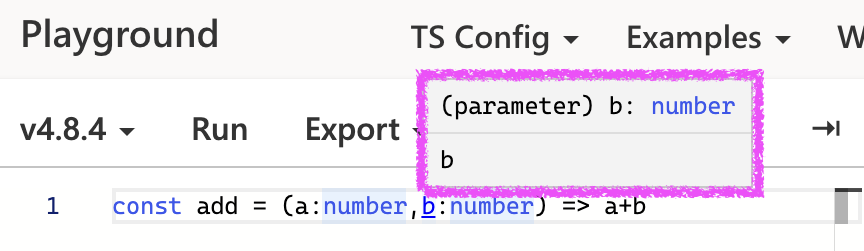

# 🚀 TypeScript 처음 시작하기
타입스크립트에 첫 입문하면서 노마드코더님의 강의 [Typescript로 블록체인 만들기](https://nomadcoders.co/typescript-for-beginners/lobby)를 들으며 실습하고 정리한 기록입니다.

</br></br>

## 💙 typeScript ➕ VScode
타입스크립트와 vs코드가 같은 마이크로 소프트에서 만들었기 때문에 호환이 아주잘되어서 개발자 경험이 좋다.

</br></br>

## ⚠️ Why not JavaScript
* 타입스크립트는 자바스크립트에 비해 **타입 안전성**이 좋다. => 개발자 경험이 좋다. 버그를 줄일 수 있다. 런타임 에러 줄인다. 생산성 증대시킨다.
* 자바스크립트는 타입 안전성이 없다.
* 자바스크립트는 되도록 에러를 보여주지 않으려 알아서 처리하는 일이 많다. 이게 개발자에게 별로 도움이 안된다.
```js
/*
😳 자바스크립트는 이렇게 이상한 코드도 실행시켜준다.
다른 언어에선 꿈도 못 꿀 일
*/

[1, 2, 3, 4] + false //'1,2,3,4false'
//배열 + 불리언 = 스트링(불리언도 스트링으로 합쳐짐)


function divide(a,b){
    return a / b
}
divide(2,3) //0.6666666666666666
divide("xxxxxxxx") //NaN (코드 실행을 막아주고 있지 않다. 이게 실행되면 안되는 거지😫!!)

//인자로 숫자를 전달해야 하는지 문자를 전달해야하는지, 몇개의 인자를 전달해야하는지 이런것들을 정해서 잘못보냈으면 체크해야 한다!!
```
* 런타임 에러는 콘솔 안에서 일어나는 에러이다. (이런 에러는 유저의 컴퓨터에서 코드가 실행될 때만 일어나는 에러일 수도 있다.)
* 자바스크립트 런타임 오류는 유저나 매니저나 동료 개발자들이 알아차리고 알려주는 경우가 많다! 
```js
const nico = { name: "nico" }
nico.hello() //Uncaught TypeError: nico.hello is not a function

/*지금처럼 ⚠️컴퓨터가 실행시키고 나서 에러를 출력하는 것이 아니라⚠️
실행시키기 전에 hello()라는 함수가 없다는 걸 알려주고 ✨"고치면 실행시켜줄게!"✨가 가장 좋다.*/
```
* **말도안되는 코드**를 **실행이아니라 작성 단계부터** 바로잡는 것! 그게 바로 타입스크립트가 자바스크립트보다 진화된 면이라고 볼 수 있다.

</br></br>

## 🤔 How TypeScript Works
* 타입스크립트는 strongly typed programmin language 강력한 타입을 가진 프로그래밍 언어이다.
* 타입스크립트로 작성한 코드는 자바스크립트로 변환된다.[타입스크립트 플레이그라운드](https://www.typescriptlang.org/play?#code/PTAEHUFMBsGMHsC2lQBd5oBYoCoE8AHSAZVgCcBLA1UABWgEM8BzM+AVwDsATAGiwoBnUENANQAd0gAjQRVSQAUCEmYKsTKGYUAbpGF4OY0BoadYKdJMoL+gzAzIoz3UNEiPOofEVKVqAHSKymAAmkYI7NCuqGqcANag8ABmIjQUXrFOKBJMggBcISGgoAC0oACCbvCwDKgU8JkY7p7ehCTkVDQS2E6gnPCxGcwmZqDSTgzxxWWVoASMFmgYkAAeRJTInN3ymj4d-jSCeNsMq-wuoPaOltigAKoASgAywhK7SbGQZIIz5VWCFzSeCrZagNYbChbHaxUDcCjJZLfSDbExIAgUdxkUBIursJzCFJtXydajBBCcQQ0MwAUVWDEQC0gADVHBQGNJ3KAALygABEAAkYNAMOB4GRonzFBTBPB3AERcwABS0+mM9ysygc9wASmCKhwzQ8ZC8iHFzmB7BoXzcZmY7AYzEg-Fg0HUiQ58D0Ii8fLpDKZgj5SWxfPADlQAHJhAA5SASPlBFQAeS+ZHegmdWkgR1QjgUrmkeFATjNOmGWH0KAQiGhwkuNok4uiIgMHGxCyYrA4PCCJSAA)로 실험해 볼 수 있다.
* 타스 ➡️ 자스로 변환하는 이유는 브라우저와 Node.js가 타스가 아니라 자스를 이해하기 때문이다. 
* 타입스크립트가 그저 자바스크립트를 변환해 줄 뿐이라면 어떻게 우리를 보호해 주는 걸까?? ➡️ 타입스크립트 코드가 자바스크립트로 변환되기 **전**에 타스가 먼저 우리의 코드를 확인한 다음에 자스에서 바보같은 실수가 일어나지 않게 보호장치를 발동시킨다! **타입스크립트 코드에 에러가 있으면 자스로 아예 컴파일이 되지 않는다.** 이런 보호장치가 유저가 코드를 실행하는 런타임에 발생하는 게 아니다.

</br></br>

## 🥊 Implicit Types vs Explicit Types
* 어떤 언어에선 변수를 설정한다면 그 변수의 타입이 뭔지 정해줘야한다.(이 변수는 항상 숫자여야해, 문장이어야해 등) 타스는 이런 접근법에 + a를 추가한다.
* 타입스크립트는 **데이터와 변수의 타입을 명시적으로 정의하는 방법**을 써도, 아니면 **그냥 JavaScript처럼 변수만 생성하고 넘어가도** 된다. 이때는 타스가 타입을 추론해 준다!!😇
```js
//📌 타스의 자동 타입 추론 기능 활용하기 (Implicit)

let a = "hello" //이렇게 적어줘도 타스가 알아서 "아! a는 string 타입이구나!!"함
a = "bye" //같은 string 타입으로 바꾸기 때문에 타스가 불평 안함
a = 1 //string에서 number타입으로 바꾸려니까 타스가 불평함😡


//📌 타스에게 친절하게 타입 알려주기 (Explicit)

let b : boolean = "x" // b는 boolean타입이어야 한다고 알려줬는데 string 넣으니까 타스가 불평한다.😡


//하지만 결국 아래의 두 코드는 같으므로, 되도록 짧은 쪽을 선택하는 것을 추천한다.
let c = false //👑 추천 (Implicit)
let c : boolean = false
```
* 하지만 명시적(explicit) 타입도 유용하게 쓰인다. (예를 들어 먼저 값을 할당하지 않을 경우엔 타입을 명시해줘야 한다.)
```js
//before💩
let a = []
a.push("1")
a.push(2) //타스의 보호를 못받음 ➡️ 에러가 나지 않는다.😈

//after✨
let b : number[] = [] //number arr라고 미리 선언한다.
b.push("1") //타스의 보호를 받음 ➡️ 에러가 난다.😇
b.push(2) 
```

</br></br>

## 🍱 Types of TS

### 🍣 basic 타입
* 지금까지 등장한 기본적인 타입들의 사용법은 아래와 같다.
```js

//Implicit Types 👑
let a = 1;
let b = 'i1';
let c = true;
let d = [1,2];
let e = ['i1','2'];
let f = [true,false];

//Explicit Types (필요한 경우가 아니라면 Implicit Types 추천)
let a : number = 1;
let b : string = 'i1';
let c : boolean = true;
let d : number[] = [1,2];
let e : string[] = ['i1','2'];
let f : boolean[] = [true,false];

```
</br>

### 🍣 객체의 타입
* 객체의 타입은 기본적으로 `let name: {key: type;} = {key: value;}`식으로 적을 수 있다.
* 객체 내부에 키가 있을 수도 없을 수도, 있다면 어떤 타입으로 존재할 건지 정하려면 `key?: type`를 적으면 된다.
```js
let player: {
  name: string;
  age?: number; //❓ = player은 age를 가질 수도, 아닐 수도 있다.
} = {
  name: "nico" //❓를 써줘서 age를 지정하지 않아도 에러가 나지 않는다.
};

// ⛔️ if(player.age < 10){ //❓를 써줬기 때문에, undefined가 나오면 제대로 비교를 할 수 없다. ➡️ 에러가 난다.😇
if(player.age && player.age < 10){ // 먼저 체크부터 해준다는 조건을 넣으면 통과 so sweet...🍬 다정해..
}

player.age = 3;
player.age = "3";  //타스의 보호를 받음 ➡️ 에러가 난다.😇

```
</br>

### 🍣 Alias 타입
* 같은 모양과 타입의 객체를 여러개 만들때, 위와 같은 방식은 코드 중복이 많이 일어난다. 이때는 따로 객체 전체를 타입으로 지정하여 쓰는 방법도 있다. 
* 이런 방법이 바로 **Alias 타입**이라고 한다.
```js
// 🧹 Alias 타입으로 객체 형태 자체를 타입으로 지정하기
type Age = number;
type Name = string;
type Player = { //uppercase 로 type을 지정하는게 관례
  name: string; //1️⃣name: Name 가능
  age?: number; //2️⃣age?: Age 가능
  /*
  위에서 Age와 Namge의 타입을 따로 Alias 타입으로 정해줬기 때문에
  1️⃣이나2️⃣와 같은 표현도 가능하다.
  */
};

let nico: Player = {
  name: "nico"
};
let lynn: Player = {
  name: "lynn",
  age: 3
};
```
</br>

### 🍣 함수 타입
* 함수가 리턴하는 값의 타입을 정해줘서 안정적인 함수를 만들 수도 있다.
* 물론 함수의 인자가 받을 타입도 지정할 수 있다.
```js
//💩 before
function playerMaker(name:string){
    return {
        name
    }
}

const nico = playerMaker("nico")
nico.age = 12 //age라는 프로퍼티를 return 값에 정의해 놓지 않아서 오류남

//✨ after
type Player = {
  name: string;
  age?: number; 
};
function playerMaker(name:string) : Player{ //🔥return 할 객체가 Player 타입을 갖게 될 것이라고 알려주기
    return {
        name
    }
}

const nico = playerMaker("nico")
nico.age = 12 //age라는 프로퍼티를 return 값에 정의해 놓지 않아서 오류남


//📌 arrow function ver.
type Player = {
  name: string;
  age?: number; 
};
const playerMaker = (name:string) : Player => ({name})
const nico = playerMaker("nico")
nico.age = 12
```
</br>

### 🍣 readonly 속성이 포함된 타입
* `readonly`속성을 줘서 요소들을 **읽기 전용**으로 만들 수 있다.
```js
type Player = {
  readonly name: string; //📙 읽기 전용 옵션 추가
  age?: number; 
};
const playerMaker = (name:string) : Player => ({name})
const nico = playerMaker("nico")
nico.age = 12
nico.name = "las" //readonly인데 name을 바꾸려니까 ➡️ 에러내서 알려줌😇
```
* 이 readonly 가능은 배열이나 string에서도 아주 유용하다.
```js
const numbers: readonly number[] = [1,2,3,4]
numbers.push(1) //readonly인데 추가하려하니까 ➡️ 에러내서 알려줌😇

const names : readonly string[] = ["nico","lynn"]
names.push('las') //readonly인데 추가하려하니까 ➡️ 에러내서 알려줌😇
names.filter(name => name === "nico" ? true : false) //📌filter나 map 등 은 immutable이므로 readonly에 위배되지 않아서 오류를 내지 않는다.
```
</br>

### 🍣 Tuple
* tuple은 최소 length가 몇이고, 특정 위치에 특정 타입이 있어야 하는 배열 조건을 걸 수 있다.
```js
const player: [string, number, boolean] = ['nico', 12, false] 
//최소 3개의 요소를 가져야한다.
//요소의 순서는 차례대로 string,number,boolean이어야 한다.
player[0] = 1 //string자리에 number추가 ➡️ 에러내서 알려줌😇
```
* tuple에서도 `readonly`옵션을 결합할 수 있다.
```js
const player: readonly [string, number, boolean] = ['nico', 12, false]
player[0] = 'hi'
```
</br>

### 🍣 undefined, null 그리고 any 타입
```js
let a : undefined = undefined //undefined의 타입은 undefined이다.
let b : null = null //null의 타입은 null이다.
```
* any 타입은 TypeScript로 부터 탈출하는 탈출구이다.
* 가끔씩은 any를 써야할 때도 있다 but!! any를 쓸거면 뭐하러 타스를 쓰냐 싶어 권장하지 않는다.👎🏻
```js
let c : any //할당되지 않은 변수는 any라는 타입이 된다. === let c
let d = [] //아무 타입도 정하지 않은 배열은 any[] 타입이된다.

const e : any[] = [1,2,3,4]
const f : any = true
e + f //이게 가능해진다. 그냥 js처럼
```
</br>

### 🍣 unknown 타입
* 만약 api로 부터 응답을 받는데 그 형식이 뭔지 모른다면 `unknown`타입을 쓸 수 있다.
* any타입과 비슷하지만 any보다 unknown이 더 안전하다. 이유는 unknown값으로 작업을 수행하는 것은 합법적이지 않기 때문
```js
//💩 before
let a: unknown;
let b = a + 1; //뭐가 들어올지 모르는데 더한다고? ➡️ 응 타스는 반대야😇

//✨ after
let a: unknown;
if(typeof a === 'number'){
    let b = a + 1;
}
if(typeof a === 'string'){
    let b = a.toUpperCase();
}
```
</br>

### 🍣 void 타입
* void > unknown > never 순으로 자주 쓰임.
* void는 아무것도 return 하지 않는 함수에 해당하는 타입이다.
* 함수에 return 문이 없거나 해당 return 문에서 명시적 값을 반환하지 않을 때 항상 유추되는 타입이다.
```js
function hello(){
    console.log('this function is void type!')
}
hello().toUpperCase() //아무것도 리턴안하는데 대문자로 바꾼다고? ➡️ 응 타스는 반대야😇

//참고로 아래와 같으므로 굳이 아래처럼 명시할 필요가 없다.
function hello():void{
    console.log('this function is void type!')
}
```
</br>

### 🍣 never 타입
* 거의 쓸일 없으나 알아두기
* never는 함수가 절대 return하지 않을 때 발생한다.
* 함수가 예외를 throw하거나 프로그램 실행을 종료함을 의미한다.
```js
//💩 before
function hello():never{
    return "X" //절대로 return 하면 안되는데 왜 리턴해? ➡️ 응 타스는 반대야😇
}

//✨ after
function hello():never{
    throw new Error("X") //return 하지 않고 오류를 발생시키는 함수니까 okay
}
```
* 또는 `never`은 타입이 두가지 일 수도 있는 상황에 발생할 수 있다.
```js
function hello(name:string|number){ //hello라는 함수가 인자로 string 혹은 number인 name을 인자로 받음
    if(typeof name === 'string'){
        name //📌이 name의 타입은 'string'이다.
    }else if(typeof name === 'number'){
        name //📌이 name의 타입은 'number'이다.
    }else{ //인자가 맞게 들어오면 이 코드는 절대 실행되지 않아야 한다.
        name //📌이 name의 타입은 ✨'never'✨이다.
    }
}
```

</br></br>

## 🚘 functions

### 🛞 Call Signature
* call signatrue란 기본적으로 마우스를 올렸을 때 보게되는 조건들을 말한다.어떻게 함수를 호출해야하는지 알려준다.인자의 타입과 반환 타입을 알려준다.

* call signature를 먼저 선언한다 = 타입을 먼저 선언한다.
* 함수를 구현하기 전에 인자와 리턴의 타입부터 정하는 방법은 깔끔하다. 첫번째로 타입을 생각하도록 해주고, 그 다음 구체적으로 코드를 적으면, 타입이 실제 코드랑 분리되서 가독성도 좋다.
```js
type Add = (a:number,b:number) => number; //📌call signatures
// type Add = {
//     (a:number,b:number) : number;
// } //이렇게 정의할 수도 있음.
const add:Add = (a,b) => a + b;
//더이상 인자와 return 값의 타입을 적어주지 않아도 된다.
```
</br>

### 🛞 Overloading
* 외부 패키지나 라이브러리를 사용할 때, 그 친구들이 오버로딩을 엄청 많이 씀. 때문에 우리가 오버로딩을 직접 작성하지 않아도 알아두는 것이 중요하다.
* 오버로딩은 **함수가 서로다른 여러개의 call signatures를 가지고 있을 때** 발생된다.
* 다시말해 오버로딩은 **여러개의 call signatures를 갖고있는 함수**이다.
```js
type Add = {
    //Add라는 타입은 1️⃣로도, 2️⃣로도 구현될 수 있다. 
    (a:number,b:number) : number //1️⃣
    (a:number,b:string) : number //2️⃣
}
const add: Add = (a,b) => { //a는 number타입, b는 number나 string타입이다.
    //그냥 a+b를 리턴하게 작성하면 b가 string일 경우 num + string에의한 타입스트립트 오류가 발생한다.
    if(typeof b === "string") return a //string일땐 따로 처리해준다.
    else return a+b
}
```
* 위는 실재로 별로 작성할 일 없는 코드고, 아래에서 우리가 패키지나 라이브러리를 쓸 때 마주칠 수 있는 overload의 예시를 볼 수 있다.
```js
//Next.js의 코드 예시
//객체로도, string으로도 인자를 넘겨줄 수 있다.
Router.push({
  path: "/home",
  state: 1
})

Router.push("/home")

//위가 가능한건 아래와 같이 오버로드로 정의했기 때문이다.

type Config = {
  path: string,
  state: object
}

type Push = {
  (path:string) : void //아무것도 리턴하지 않으므로 void
  (config: Config) : void
}

const push : Push = (config) => {
  if(typeof config === "string") console.log(config)
  else {
      console.log(config.path, config.state)
    }
}
```
* signature도 다르고, arguments의 number도 다른 경우가 있을 수 있다.
```js
//💩before
type Add = {
  (a:number, b:number) : number
  (a:number, b:number, c:number) : number
}

const add:Add = (a, b, c) => { //c인자는 optional한데 그냥 넣어주고 있어서 불평한다.
  return a + b
}

//✨after
type Add = {
  (a:number, b:number) : number
  (a:number, b:number, c:number) : number
}

const add:Add = (a, b, c?:number) => { //optional한 것에 맞게 넣어준다. optional하고 들어갈거면 number일거야!!
  if(c) return a + b + c
  return a + b
}

add(1,2)
add(1,2,3)
```